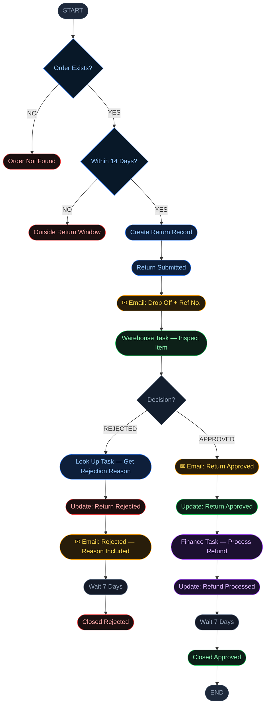

# ReturnFlow — Order Return Application

> A ServiceNow scoped application that automates the end-to-end
> order return process for retail customers. Built as a capstone
> project on the ServiceNow platform.

---

## The Problem

Retail returns are a $890 billion global problem. Most organisations
still handle them manually through call centres, bots, and
overwhelmed frontline staff. Customers wait. Staff are overwhelmed.
Requests get lost.

- **16.9%** of all retail sales are returned annually
- **67%** of customers say a bad return experience stops them
  shopping with that brand again

*Source: NRF & Happy Returns, 2024*

---

## The Solution

ReturnFlow is a self-service ServiceNow application where customers
submit return requests in minutes, get instant eligibility validation,
and receive real-time updates at every stage without ever reaching
an agent.

---

## The Customer Journey

Submit Request → Instant Validation → Drop-off Email → Warehouse Inspection → Refund Processed → Closed

---

## Platform Features Used

| #  | Feature              |
|----|----------------------|
| 01 | Scoped Application   |
| 02 | Tables & Forms       |
| 03 | UI Policies          |
| 04 | Roles & ACLs         |
| 05 | Record Producer      |
| 06 | Service Catalog Item |
| 07 | Flow Designer        |
| 08 | Notifications        |
| 09 | Knowledge Articles   |
| 10 | Dashboard & Reports  |
| 11 | Source Control       |
| 12 | Client Scripts       |
| 13 | Business Rules       |

---

## Repository Structure

    ReturnFlow/
    │
    ├── README.md
    │
    ├── servicenow-config/
    │   ├── [app-hash-folder]/
    │   └── sn_source_control.properties
    │
    ├── docs/
    │   ├── business-requirements.md
    │   ├── technical-documentation.md
    │   └── user-guide.md
    │
    ├── scripts/
    │   ├── business-rule-validation.js
    │   ├── business-rule-order-date.js
    │   └── business-rule-requested-for.js
    │
    ├
    │
    │
    └── screenshots/
        ├── portal-homepage.png
        ├── return-form.png
        ├── warehouse-task.png
        ├── finance-task.png
        └── dashboard.png

---

## Documentation

- [Business Requirements](docs/business-requirements.md)
- [Technical Documentation](docs/technical-documentation.md)
- [User Guide](docs/user-guide.md)

---

## The Team

| Name                     | Role          |
|--------------------------|---------------|
| Emeka Iwu                | Project Lead  |
| Abiodun Alao             | Implementer   |
| Lawrence Egwuonwu        | Implementer   |
| Michael Ayeni            | Sys Admin     |
| Gauri Phapale            | Sys Admin     |
| Fiyinfoluwa Adebola Oriade | Sys Admin   |

---

## Screenshots

> Screenshots of the live application are in the `/screenshots` folder.

---
## Importing into ServiceNow

To import this application into a ServiceNow PDI:

1. Fork or clone this repository
2. In ServiceNow Studio, go to **Source Control → Import from Source Control**
3. Point to this repository using the **servicenow-config/** folder — 
   not the root of the repository
4. Use branch: **main**

> Note: Only the `servicenow-config/` folder contains the Studio 
> app export. Do not link to the parent folder.

---
*Built part-time. Shipped on time. Designed to give customers their wait time back.*
